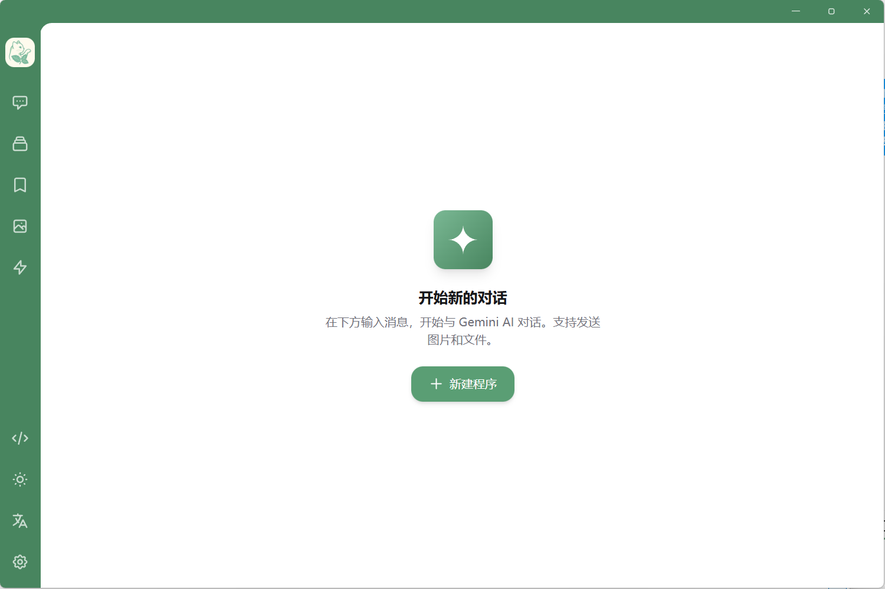
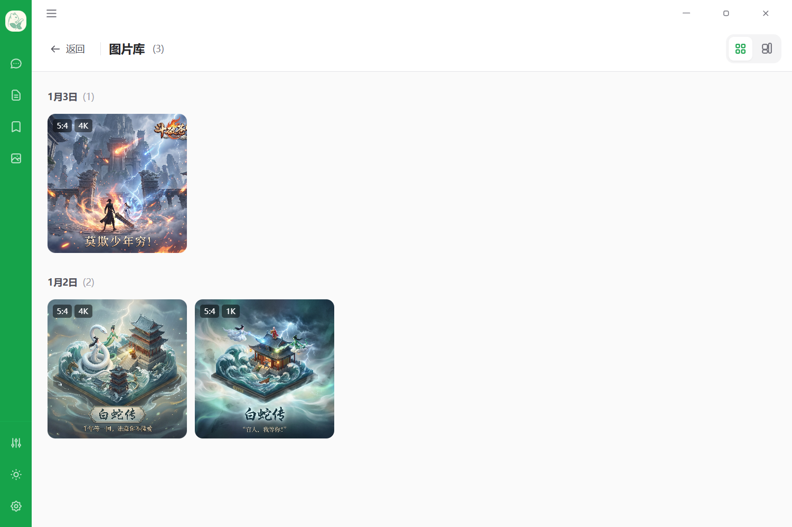
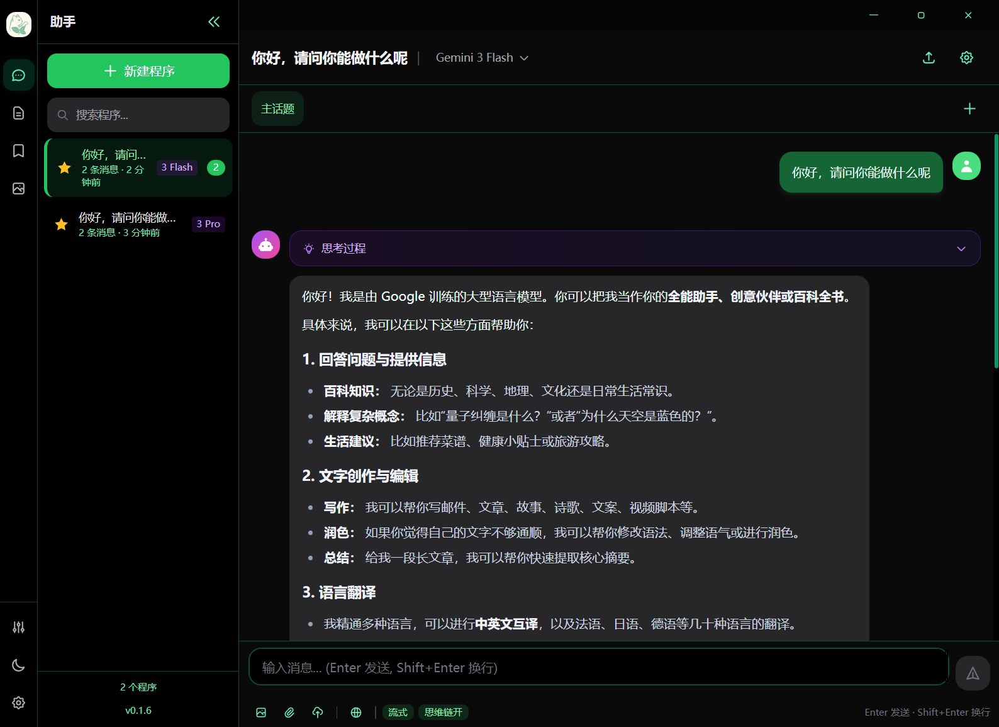
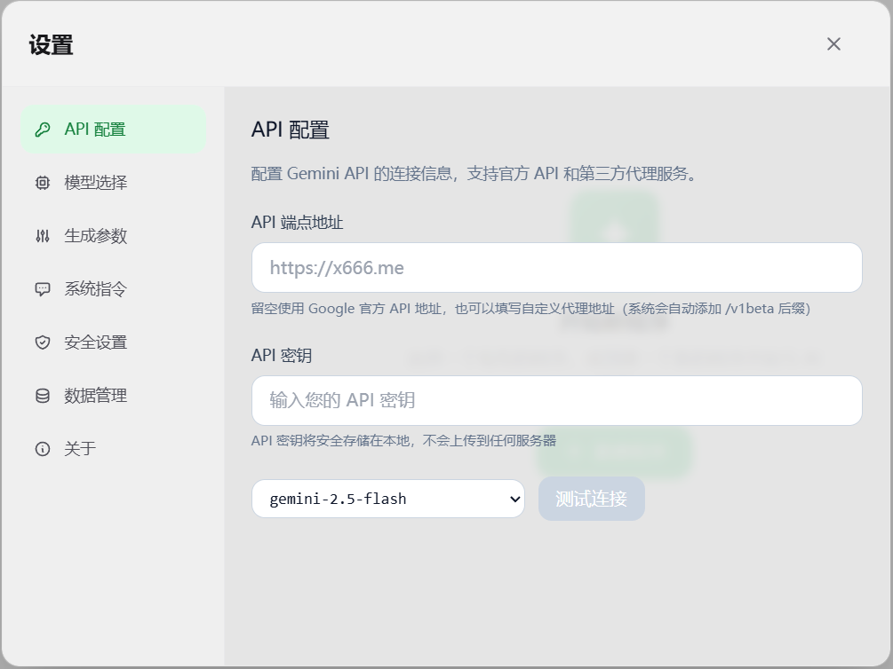

# Gemini Chat

<p align="center">
  
</p>

<p align="center">
  <strong>一个功能丰富的 Google Gemini API 聊天客户端</strong><br>
  支持多模型、图片生成、思维链展示等高级功能
</p>

<p align="center">
  <a href="https://github.com/bohesocool/gemini-chat/releases"></a>
  <a href="https://github.com/bohesocool/gemini-chat/blob/main/LICENSE"></a>
  <a href="https://github.com/bohesocool/gemini-chat/stargazers"></a>
  <a href="https://hub.docker.com/r/bohesocool/gemini-chat"></a>
</p>

<p align="center">
  <a href="#-功能特性">功能特性</a> •
  <a href="#-界面预览">界面预览</a> •
  <a href="#-快速开始">快速开始</a> •
  <a href="#-docker-部署">Docker 部署</a> •
  <a href="#-配置说明">配置说明</a>
</p>

---

## ✨ 功能特性

### 🤖 多模型支持

| 系列 | 支持模型 |
|------|----------|
| Gemini 3 | Pro、Pro Image（最智能的多模态模型） |
| Gemini 2.5 | Pro、Flash、Flash-Lite、Flash-Image |
| Gemini 2.0 | Flash、Flash-Lite |

- ✅ 支持自定义 API 端点（兼容第三方代理）
- ✅ 每个模型独立的参数配置
- ✅ **模型重定向** - 将自定义模型重定向到预设模型，自动继承目标模型的能力和参数配置

### 💬 聊天功能

- **多窗口管理** - 创建多个独立的聊天窗口，每个窗口可配置不同的模型和参数
- **子话题对话** - 在同一窗口内创建多个子话题，方便组织不同的对话主题
- **消息编辑** - 支持编辑已发送的消息并重新生成回复
- **流式响应** - 实时显示 AI 回复，支持随时停止生成
- **思维链展示** - 支持显示模型的思考过程（Gemini 2.5/3 系列）
- **Markdown 渲染** - 完整支持 Markdown 格式，包括代码高亮和 LaTeX 数学公式

### 🖼️ 图片功能

- **图片上传** - 支持上传图片进行多模态对话
- **图片生成** - 使用 Imagen 模型生成图片（Gemini 3 Pro Image、2.5 Flash Image）
- **图片画廊** - 集中管理所有生成的图片
- **全屏预览** - 支持图片全屏查看和下载

### ⚙️ 高级配置

| 配置项 | 说明 |
|--------|------|
| 生成参数 | Temperature、Top-P、Top-K、最大输出 Token |
| 思考预算 | 控制模型思考深度（Gemini 2.5 系列支持 Token 预算配置） |
| 思考等级 | 选择思考深度级别（Gemini 3 系列支持 Low/High 等级） |
| 图片参数 | 调整图片模型的分辨率/宽高比 |
| 媒体分辨率 | 调整输入图片/视频的处理分辨率 |
| 系统指令 | 为每个聊天窗口设置独立的系统提示词 |

- 💡 **快捷参数调整** - 常用参数（思考程度、图片设置）可直接在聊天输入框上方快速修改，无需打开设置面板

<p align="center">
  
</p>

### 🔐 安全功能

- **密码保护** - 支持通过环境变量设置访问密码
- **本地存储** - 所有数据存储在浏览器本地（IndexedDB），不上传到服务器

### 🎨 界面特性

- 深色/浅色主题切换
- 响应式设计，适配桌面和移动设备
- 可折叠侧边栏
- 调试面板（查看 API 请求详情、Token 使用量）

---

## 📸 界面预览

### 主界面

<p align="center">
  
</p>

### 图片画廊

<p align="center">
  
</p>

### 午夜薄荷主题

<p align="center">
  
</p>

### 模型重定向

<p align="center">
  
</p>

> 模型重定向功能允许你将自定义模型（如第三方代理的模型）重定向到预设模型，自动继承目标模型的能力配置（思考程度、图片生成等），无需重复配置。

---

## 🚀 快速开始

### 环境要求

- Node.js 18+
- npm / yarn / pnpm

### 本地开发

```bash
# 克隆项目
git clone https://github.com/bohesocool/gemini-chat.git
cd gemini-chat

# 安装依赖
npm install

# 配置环境变量
cp .env.example .env
# 编辑 .env 文件，设置 VITE_AUTH_PASSWORD=your_password

# 启动开发服务器
npm run dev
```

访问 http://localhost:5173 即可使用。

> **提示**: 如果不设置 `VITE_AUTH_PASSWORD`，将使用默认密码 `adminiadmin`，首次登录后会提示修改。

---

## 💻 Windows 桌面应用

直接从 [GitHub Releases](https://github.com/bohesocool/gemini-chat/releases) 下载最新版本的 Windows 安装包。


---

## 🐳 Docker 部署

### 方式一：直接拉取镜像（推荐）

```bash
# 拉取镜像
docker pull bohesocool/gemini-chat:latest

# 运行容器
docker run -d \
  -p 5173:80 \
  -e VITE_AUTH_PASSWORD=your_password \
  --name gemini-chat \
  bohesocool/gemini-chat:latest
```

### 方式二：Docker Compose

```bash
# 克隆项目
git clone https://github.com/bohesocool/gemini-chat.git
cd gemini-chat

# 配置环境变量
cp .env.example .env
vim .env  # 修改 VITE_AUTH_PASSWORD

# 启动服务
docker-compose up -d

# 查看日志
docker-compose logs -f

# 停止服务
docker-compose down

# 更新容器
git pull && docker-compose down && docker-compose up -d --build
```

### 密码说明

| 场景 | 说明 |
|------|------|
| 未设置环境变量 | 使用默认密码 `adminiadmin`，首次登录后需修改 |
| 已设置自定义密码 | 直接使用设置的密码，无需修改 |

部署完成后访问 http://localhost:5173 即可使用。

---

## ⚙️ 配置说明

### API 配置

1. 打开应用后，点击侧边栏底部的 **设置图标**
2. 在「API 设置」中填入你的 **Google AI API Key**
3. API 端点留空将使用官方地址，也可填入第三方代理地址

<p align="center">
  
</p>

### 获取 API Key

1. 访问 [Google AI Studio](https://aistudio.google.com/)
2. 登录 Google 账号
3. 点击「Get API Key」获取密钥

---

## 🛠️ 技术栈

| 类别 | 技术 |
|------|------|
| 框架 | React 18 + TypeScript |
| 构建工具 | Vite 6 |
| 状态管理 | Zustand 5 |
| 样式 | Tailwind CSS 3 |
| Markdown | react-markdown + rehype-highlight + rehype-katex |
| 本地存储 | IndexedDB (idb) |
| 部署 | Docker + Nginx |

---

## 🤝 贡献

欢迎提交 Issue 和 Pull Request！

## 📜 许可证

本项目采用 [MIT License](LICENSE) 开源许可证。

---

## ⭐ Star History

[](https://star-history.com/#bohesocool/gemini-chat&Date)
