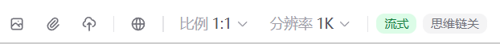
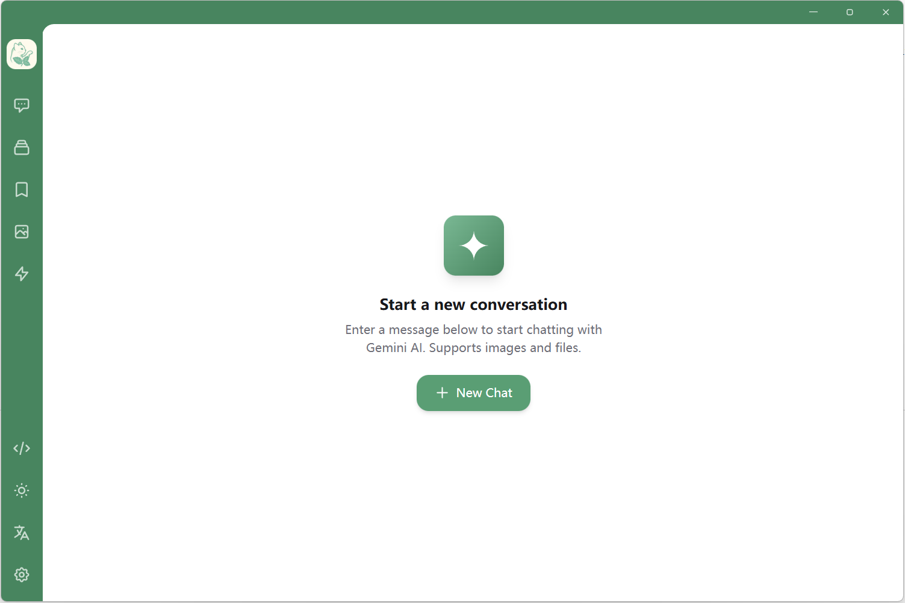
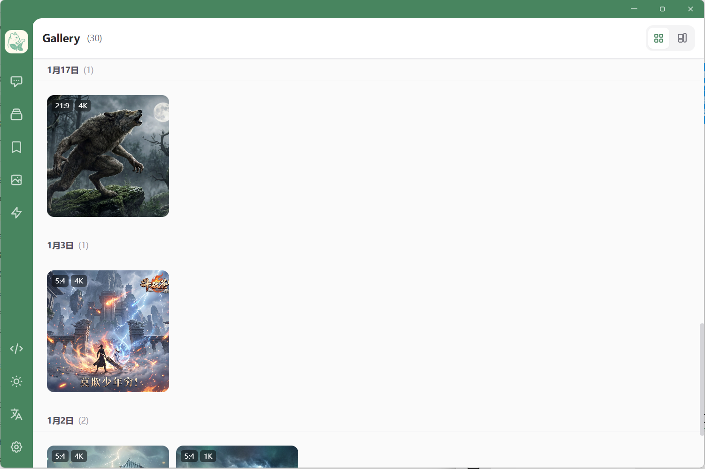
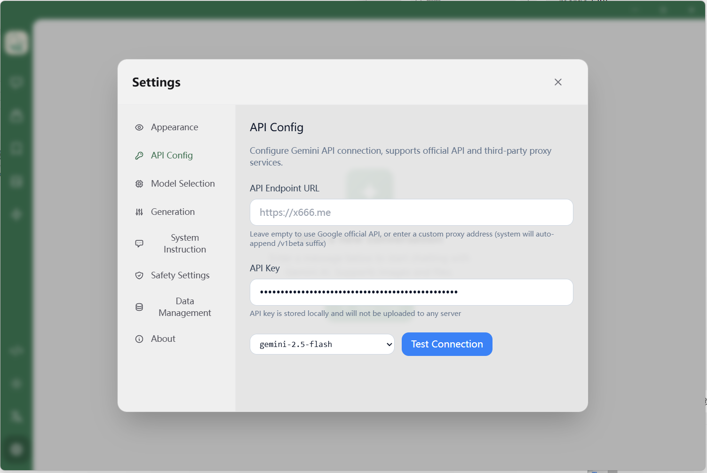

[中文](README.md) | English

# Gemini Chat

<p align="center">
  
</p>

<p align="center">
  <strong>A Feature-Rich Google Gemini API Chat Client</strong><br>
  Supporting multi-model, image generation, chain-of-thought display, and more advanced features
</p>

<p align="center">
  <a href="https://github.com/bohesocool/gemini-chat/releases"></a>
  <a href="https://github.com/bohesocool/gemini-chat/blob/main/LICENSE"></a>
  <a href="https://github.com/bohesocool/gemini-chat/stargazers"></a>
  <a href="https://hub.docker.com/r/bohesocool/gemini-chat"></a>
</p>

<p align="center">
  <a href="#-features">Features</a> •
  <a href="#-screenshots">Screenshots</a> •
  <a href="#-quick-start">Quick Start</a> •
  <a href="#-docker-deployment">Docker Deployment</a> •
  <a href="#-configuration">Configuration</a>
</p>

---

## ✨ Features

### 🤖 Multi-Model Support

| Series | Supported Models |
|--------|------------------|
| Gemini 3 | Pro, Pro Image (Most intelligent multimodal model) |
| Gemini 2.5 | Pro, Flash, Flash-Lite, Flash-Image |
| Gemini 2.0 | Flash, Flash-Lite |

- ✅ Custom API endpoint support (compatible with third-party proxies)
- ✅ Independent parameter configuration for each model
- ✅ **Model Redirect** - Redirect custom models to preset models, automatically inheriting target model's capabilities and parameter configurations

### 💬 Chat Features

- **Multi-Window Management** - Create multiple independent chat windows, each configurable with different models and parameters
- **Sub-Topic Conversations** - Create multiple sub-topics within the same window for organizing different conversation themes
- **Message Editing** - Edit sent messages and regenerate responses
- **Streaming Response** - Real-time AI response display with stop generation support
- **Chain-of-Thought Display** - Display model's thinking process (Gemini 2.5/3 series)
- **Markdown Rendering** - Full Markdown support including code highlighting and LaTeX math formulas

### 🖼️ Image Features

- **Image Upload** - Upload images for multimodal conversations
- **Image Generation** - Generate images using Imagen models (Gemini 3 Pro Image, 2.5 Flash Image)
- **Image Gallery** - Centralized management of all generated images
- **Fullscreen Preview** - Support fullscreen image viewing and downloading

### ⚙️ Advanced Configuration

| Configuration | Description |
|---------------|-------------|
| Generation Parameters | Temperature, Top-P, Top-K, Max Output Tokens |
| Thinking Budget | Control model thinking depth (Gemini 2.5 series supports Token budget configuration) |
| Thinking Level | Select thinking depth level (Gemini 3 series supports Low/High levels) |
| Image Parameters | Adjust image model resolution/aspect ratio |
| Media Resolution | Adjust input image/video processing resolution |
| System Instructions | Set independent system prompts for each chat window |

- 💡 **Quick Parameter Adjustment** - Common parameters (thinking level, image settings) can be quickly modified directly above the chat input box without opening the settings panel

<p align="center">
  
</p>

### 🔐 Security Features

- **Password Protection** - Support setting access password via environment variables
- **Local Storage** - All data stored locally in browser (IndexedDB), not uploaded to server

### 🎨 Interface Features

- Dark/Light theme switching
- Responsive design for desktop and mobile devices
- Collapsible sidebar
- Debug panel (view API request details, token usage)

---

## 📸 Screenshots

### Main Interface

<p align="center">
  
</p>

### Image Gallery

<p align="center">
  
</p>

### Model Redirect

<p align="center">
  
</p>

> The Model Redirect feature allows you to redirect custom models (such as third-party proxy models) to preset models, automatically inheriting the target model's capability configurations (thinking level, image generation, etc.) without repeated configuration.

---

## 🚀 Quick Start

### Requirements

- Node.js 18+
- npm / yarn / pnpm

### Local Development

```bash
# Clone the project
git clone https://github.com/bohesocool/gemini-chat.git
cd gemini-chat

# Install dependencies
npm install

# Configure environment variables
cp .env.example .env
# Edit .env file, set VITE_AUTH_PASSWORD=your_password

# Start development server
npm run dev
```

Visit http://localhost:5173 to use the application.

> **Tip**: If `VITE_AUTH_PASSWORD` is not set, the default password `adminiadmin` will be used, and you will be prompted to change it after first login.

---

## 💻 Windows Desktop Application

Download the latest Windows installer directly from [GitHub Releases](https://github.com/bohesocool/gemini-chat/releases).


---

## 🐳 Docker Deployment

### Method 1: Pull Image Directly (Recommended)

```bash
# Pull image
docker pull bohesocool/gemini-chat:latest

# Run container
docker run -d \
  -p 5173:80 \
  -e VITE_AUTH_PASSWORD=your_password \
  --name gemini-chat \
  bohesocool/gemini-chat:latest
```

### Method 2: Docker Compose

```bash
# Clone the project
git clone https://github.com/bohesocool/gemini-chat.git
cd gemini-chat

# Configure environment variables
cp .env.example .env
vim .env  # Modify VITE_AUTH_PASSWORD

# Start service
docker-compose up -d

# View logs
docker-compose logs -f

# Stop service
docker-compose down

# Update container
git pull && docker-compose down && docker-compose up -d --build
```

### Password Notes

| Scenario | Description |
|----------|-------------|
| Environment variable not set | Use default password `adminiadmin`, must change after first login |
| Custom password set | Use the configured password directly, no change required |

After deployment, visit http://localhost:5173 to use the application.

---

## ⚙️ Configuration

### API Configuration

1. After opening the app, click the **Settings icon** at the bottom of the sidebar
2. Enter your **Google AI API Key** in "API Settings"
3. Leave API endpoint empty to use the official address, or enter a third-party proxy address

<p align="center">
  
</p>

### Getting API Key

1. Visit [Google AI Studio](https://aistudio.google.com/)
2. Sign in with your Google account
3. Click "Get API Key" to obtain your key

---

## 🛠️ Tech Stack

| Category | Technology |
|----------|------------|
| Framework | React 18 + TypeScript |
| Build Tool | Vite 6 |
| State Management | Zustand 5 |
| Styling | Tailwind CSS 3 |
| Markdown | react-markdown + rehype-highlight + rehype-katex |
| Local Storage | IndexedDB (idb) |
| Deployment | Docker + Nginx |

---

## 🤝 Contributing

Issues and Pull Requests are welcome!

## 📜 License

This project is licensed under the [MIT License](LICENSE).

---

## ⭐ Star History

[](https://star-history.com/#bohesocool/gemini-chat&Date)
